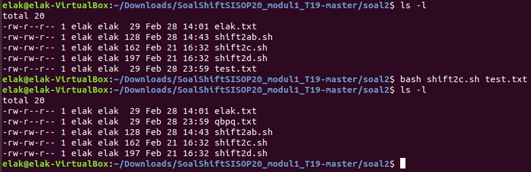

# SoalShiftSISOP20_modul1_T19

## Nama Angggota

- Adeela Nurul Fadhila [05311840000001]
- Muhammad Zulfikar Fauzi [05311840000012]

# Nomor 1

Whits adalah seorang mahasiswa teknik informatika. Dia mendapatkan tugas praktikum
untuk membuat laporan berdasarkan data yang ada pada file “Sample-Superstore.tsv”.
Namun dia tidak dapat menyelesaikan tugas tersebut. Laporan yang diminta berupa :

  1. Tentukan wilayah bagian (region) mana yang memiliki keuntungan (profit) paling
     sedikit
  2. Tampilkan 2 negara bagian (state) yang memiliki keuntungan (profit) paling
     sedikit berdasarkan hasil poin a
  3. Tampilkan 10 produk (product name) yang memiliki keuntungan (profit) paling
     sedikit berdasarkan 2 negara bagian (state) hasil poin b
    
Whits memohon kepada kalian yang sudah jago mengolah data untuk mengerjakan
laporan tersebut.

*Gunakan Awk dan Command pendukung

#### Link code soal 1 :

##### Source code : [Soal1fix.sh](https://github.com/bawangcode/SoalShiftSISOP20_modul1_T19/blob/master/soal1/Soal1fix.sh)

##### Data : [Sample-Superstore.tsv](https://github.com/bawangcode/SoalShiftSISOP20_modul1_T19/blob/master/soal1/Sample-Superstore.tsv)

jawaban:

#### 1a.
     region=`awk -F '\t' 'NR>1 {regions[$13]+=$21} END { for ( i in regions) print i,regions[i] | "sort -gk2" }' Sample-Superstore.tsv | awk 'NR==1 {print $1}'` 
     printf "Region dengan profit terkecil adalah $region\n\n"

- Pertama kita buat awk dengan pemisah tab ('\t'). Karena row pertama merupakan nama dari tabel sehingga tidak memiliki data, maka digunakan __NR>1__.
- __{regions[$13]+=$21}__ digunakan untuk menjumlahkan keseluruhan profit yang ada di masing-masing state.
- __END{}__ artinya kode ini dijalankan sekali dan di akhir saja.
- __for (i in regions) print i,regions[i]__ digunakan untuk menampilkan seluruh array dan nilai yang ada di dalam array.
- __"sort -gk2"__ digunakan untuk mengurutkan array dari yang terkecil ke terbesar berdasarkan nilai dari arry tersebut. __-g__ karena profit bertipe data float. kemudian __k2__ karena profit ada di kolom kedua.
- lalu di pipe dan awk lagi untuk memasukkan baris pertama ke dalam "region".
- yang terakhir adalah menampilkan isi dari variabel region.

#### 1b.
     states=`awk -v r=$region -F '\t' 'NR>1 { if(match($13, r)) states[$11]+=$21} END { for ( j in states) print states[j], j | "sort -gk1" }' Sample-Superstore.tsv | awk 'NR<3 {print $2}'`
     printf "2 State dengan profit terkecil adalah : \n$states\n"

- Logika yang digunakan sama dengan nomor 1a hanya saja menambahkan __match__ untuk tabel ke 13 dan 11. Logikanya adalah, jika tabel 13 yaitu state isinya sama seperti hasil output di 1a, maka tabel states nya akan dimasukkan ke dalam array. Jadi, isi dari array adalah state yang berada dalam region sesuai dengan output 1a beserta nilai/besar profitnya.
- kemudian menggunakan __NR<3__ karena output yang akan ditampilkan adalah 2 yang paling kecil atau 2 teratas.

#### 1c.
     states1=`echo $states | awk '{print $1}'`
     states2=`echo $states | awk '{print $2}'`
     printf "\n\n"
     echo "10 Produk dengan profit terdikit dari state $states1 :"
     awk -v s=$states1 -F '\t' 'NR>1 { if(match($11, s)) produk[$17]+=$21} END { for ( k in produk) print produk[k], k | "sort -gk1" }' Sample-Superstore.tsv | awk 'NR<11 {$1=""; print $0}'
     printf "\n\n"
     echo "10 Produk dengan profit terdikit dari state $states2 :"
     awk -v s=$states2 -F '\t' 'NR>1 { if(match($11, s)) produk[$17]+=$21} END { for ( k in produk) print produk[k], k | "sort -gk1" }' Sample-Superstore.tsv | awk 'NR<11 {$1=""; print $0}'

- Output yang diminta adalah 10 produk dengan profit terkecil dari masing-masing state, jadi total produknya ada 20
- Dua state dengan profit terkecil yang telah didapat dari nomor 1b, dimasukkan ke dalam variabel __states1__ dan __states2__.
- Logika yang digunakan sama dengan nomor sebelumnya, yaitu 1a dan 1b dengan menggunakan __match__
- __NR<11__ digunakan untuk menampilkan 10 baris teratas, karena yang diminta hanya 10 produk
- __$1=""__ digunakan untuk menghilangkan kolom pertama yang berisi nilai profit (angka)
- __print $0__ digunakan untuk menampilkan semua isi dari kolom yang ada

# Nomor 2

Pada suatu siang, laptop Randolf dan Afairuzr dibajak oleh seseorang dan kehilangan
data-data penting. Untuk mencegah kejadian yang sama terulang kembali mereka
meminta bantuan kepada Whits karena dia adalah seorang yang punya banyak ide.
Whits memikirkan sebuah ide namun dia meminta bantuan kalian kembali agar ide
tersebut cepat diselesaikan. Idenya adalah kalian (a) membuat sebuah script bash yang
dapat menghasilkan password secara acak sebanyak 28 karakter yang terdapat huruf
besar, huruf kecil, dan angka. (b) Password acak tersebut disimpan pada file berekstensi
.txt dengan nama berdasarkan argumen yang diinputkan dan HANYA berupa alphabet.
(c) Kemudian supaya file .txt tersebut tidak mudah diketahui maka nama filenya akan di
enkripsi dengan menggunakan konversi huruf (string manipulation) yang disesuaikan
dengan jam(0-23) dibuatnya file tersebut dengan program terpisah dengan (misal:
password.txt dibuat pada jam 01.28 maka namanya berubah menjadi qbttxpse.txt
dengan perintah ‘bash soal2_enkripsi.sh password.txt’. Karena p adalah huruf ke 16 dan
file dibuat pada jam 1 maka 16+1=17 dan huruf ke 17 adalah q dan begitu pula
seterusnya. Apabila melebihi z, akan kembali ke a, contoh: huruf w dengan jam 5.28,
maka akan menjadi huruf b.) dan (d) jangan lupa untuk membuat dekripsinya supaya
nama file bisa kembali.

HINT: enkripsi yang digunakan adalah caesar cipher.

*Gunakan Bash Script

#### Link code soal 2 :

##### Soal 2a dan 2b : [shift2ab.sh](https://github.com/bawangcode/SoalShiftSISOP20_modul1_T19/blob/master/soal2/shift2ab.sh)

##### Soal 2c : [shift2c.sh](https://github.com/bawangcode/SoalShiftSISOP20_modul1_T19/blob/master/soal2/shift2c.sh)

##### Soal 2d : [shift2d.sh](https://github.com/bawangcode/SoalShiftSISOP20_modul1_T19/blob/master/soal2/shift2d.sh)

jawaban :

#### 2a dan 2b

     #!/bin/bash
     
     cat /dev/urandom | tr -dc '0-9 A-Z a-z' | fold -w 28 | head -n 1 | sed 's/ //g' > `echo $1 | tr -dc 'A-Z a-z'`.txt

- __cat >__ berfungsi untuk meng-overwrite file dengan tulisan baru.
- __/dev/urandom__ digunakan untuk menampilkan karakter random. Karakter ini sangat banyak dan benar-benar random, oleh karena itu diberi tambahan __tr -dc__ untuk memberikan batasan pada karakter random yang ditampilkan. Dalam kasus ini diminta hanya alfabet dan numerik, maka menggunakan __'0-9 A-Z a-z'__ sehingga karakter selain itu tidak ditampilkan.
- __fold -w 28__ digunakan untuk membatasi panjang karakter, dalam hal ini jumlahnya 28 karakter.
- __head -n 1__ untuk menampilkan hanya satu baris saja. jika tidak diberi batasan ini maka akan terus meng-generate karakter random sebanyak 28 karakter
- __sed__ digunakan untuk mengedit atau mengubah karakter menjadi karakter lain. __'s/ //g'__ untuk menyatakan apa yang ingin diubah dan apa hasilnya setelah diubah. dalam kasus ini adalah untuk mengubah spasi menjadi tidak ada.
- __echo $1__ untuk menampilkan karakter random tadi ke dalam file
- __tr -dc 'A-Z a-z'__ sama seperti sebelumnya, ini digunakan untuk memberi batasan nama file yang diinputkan. Kemudian __.txt__ adalah extensi dari filenya.

#### 2c

     #!/bin/bash
     
     for nama in $@
     do
     waktu=`date +%H -r $nama`
     nama_sblm=`basename $nama .txt`
     nama_stlh=`echo $nama_sblm | caesar $waktu`
     mv $nama $nama_stlh.txt
     done

- Pertama adalah melakukan pengulangan untuk mendapatkan input dan memasukkannya ke dalam variabel nama. Di sini menggunakan __$@__ agar semua input dapat terbaca.
- kemudian membuat variabel __waktu__ yang berisi waktu terakhir kali file dimodified. __date +%H -r__ digunakan untuk mendapatkan _last modification of file_, __%H__ untuk mendapatkan jamnya (misal 5.03 yang diambil adalah 5), sedangkan __-r__ menampilkan waktu/pukul berapa file itu terakhir di modifikasi (misal 02.39)
- Selanjutnya membuat variabel __nama_sblm__ yang berisi perintah untuk menghilangkan ekstensi dari file, yaitu .txt
- Lalu meng-enkripsi nama file yang telah dihilangkan ekstensinya dengan menggunakan caesar chipper yang menggunakan perhitungan berdasarkan __waktu__, kemudian dimasukkan ke dalam variabel __nama_stlh__
- Terakhir adalah me-rename file tersebut dengan command __mv__

#### 2d

     #!/bin/bash
     
     for nama in $@
     do
     waktu=`date +%H -r $nama`
     nama_sblm=`basename $nama .txt`
     waktu_baru=`expr 26 - $waktu`
     nama_stlh=`echo $nama_sblm | caesar $waktu_baru`
     mv $nama $nama_stlh.txt
     done

- Nomor 2d merupakan kebalikan dari nomor 2c karena merupakan dekripsi.
- Perbedaannya terletak pada variabel __waktu baru__ yang isinya adalah 26 (jumlah alfabet) dikurangi dengan __waktu__ agar perhitungannya dapat kembali lagi ke huruf aslinya.

# Nomor 3

1 tahun telah berlalu sejak pencampakan hati Kusuma. Akankah sang pujaan hati
kembali ke naungan Kusuma? Memang tiada maaf bagi Elen. Tapi apa daya hati yang
sudah hancur, Kusuma masih terguncang akan sikap Elen. Melihat kesedihan Kusuma,
kalian mencoba menghibur Kusuma dengan mengirimkan gambar kucing. [a] Maka dari
itu, kalian mencoba membuat script untuk mendownload 28 gambar dari
"https://loremflickr.com/320/240/cat" menggunakan command wget dan menyimpan file
dengan nama "pdkt_kusuma_NO" (contoh: pdkt_kusuma_1, pdkt_kusuma_2,
pdkt_kusuma_3) serta jangan lupa untuk menyimpan log messages wget kedalam
sebuah file "wget.log". Karena kalian gak suka ribet, kalian membuat penjadwalan untuk menjalankan script download gambar tersebut. Namun, script download tersebut hanya
berjalan[b] setiap 8 jam dimulai dari jam 6.05 setiap hari kecuali hari Sabtu Karena
gambar yang didownload dari link tersebut bersifat random, maka ada kemungkinan
gambar yang terdownload itu identik. Supaya gambar yang identik tidak dikira Kusuma
sebagai spam, maka diperlukan sebuah script untuk memindahkan salah satu gambar
identik. Setelah memilah gambar yang identik, maka dihasilkan gambar yang berbeda
antara satu dengan yang lain. Gambar yang berbeda tersebut, akan kalian kirim ke
Kusuma supaya hatinya kembali ceria. Setelah semua gambar telah dikirim, kalian akan
selalu menghibur Kusuma, jadi gambar yang telah terkirim tadi akan kalian simpan
kedalam folder /kenangan dan kalian bisa mendownload gambar baru lagi. [c] Maka dari
itu buatlah sebuah script untuk mengidentifikasi gambar yang identik dari keseluruhan
gambar yang terdownload tadi. Bila terindikasi sebagai gambar yang identik, maka
sisakan 1 gambar dan pindahkan sisa file identik tersebut ke dalam folder ./duplicate
dengan format filename "duplicate_nomor" (contoh : duplicate_200, duplicate_201).
Setelah itu lakukan pemindahan semua gambar yang tersisa kedalam folder ./kenangan
dengan format filename "kenangan_nomor" (contoh: kenangan_252, kenangan_253).
Setelah tidak ada gambar di current directory, maka lakukan backup seluruh log menjadi
ekstensi ".log.bak".

Hint : Gunakan wget.log untuk membuat location.log yang isinya
merupakan hasil dari grep "Location".

*Gunakan Bash, Awk dan Crontab

#### Link code soal 3 :

##### Soal 3a : [shift3a](https://github.com/bawangcode/SoalShiftSISOP20_modul1_T19/blob/master/soal3/Soal3afix.sh)

##### Soal 3b : [shift3b](https://github.com/bawangcode/SoalShiftSISOP20_modul1_T19/blob/master/soal3/crontabsoal3b)

##### Soal 3c : [shift3c](https://github.com/bawangcode/SoalShiftSISOP20_modul1_T19/blob/master/soal3/Soal3cfix.sh)

jawaban:

#### 3a

     #!bin/bash
     
     now=`ls -d pdkt_kusuma_* | wc -l`
     if [ $now == 0 ]
     then
      now=1
      max=28
     else
      max=$now+28
     fi
     
     for ((i=now; i<=max; i=i+1))
     do
     wget -O "pdkt_kusuma_$i"  -a "temp.log" "https://loremflickr.com/320/240/cat"
     done
     
     cat temp.log >> wget.log
     rm temp.log

- __ls -d__ digunakan untuk menampilkan file di directory sekarang, __wc -l__ digunakan untuk menghitung berapa jumlah output line. Maka dari itu yang terjadi disini adalah, __ls -d__ akan menghasilkan output berupa file - file dengan nama 'pdkt_kusuma_\*' simbol asterisk digunakan sebagai wildcard. Lalu dari hasil tersebut kita hitung ada berapa banyak jumlah file 'pdkt_kusuma_' menggunakan __wc -l__ lalu disimpan dalam variable now. variable now ini digunakan untuk melakukan penamaan file 'pdkt_kusuma' berkelanjutan.
- __if \[ $now == 0 ]__ digunakan untuk mengecek jika nilai dari now adalah 0, jika 0 maka __then__ akan terjalankan yang isinya  menjadikan isi dari variable now 1 dan max 28. Selain itu, maka max adalah isi dari now ditambah dengan 28. __fi__ untuk menutup __if__ diawal.
- perulangan __for ((i=now; i<=max; i=i+1))__ digunakan untuk melakukan command __wget__ sebanyak 28 kali.
- __-O__ digunakan untuk merename file manjadi 'pdkt_kusuma_', __-a__ digunakan untuk menyimpan log kedalam 'temp.log'.
- __cat__ akan menambahkan isi dari 'temp.log' kedalam 'wget.log' karena digunakan __>>__.
- __rm__ akan menghapus 'temp.log'

Berikut adalah hasil dari eksekusi program tersebut. Terlihat bahwa ada 28 gambar dengan nama 'pdkt_kusuma_1' dan seterusnya.

#### 3b

     5 6/8 * * 1-5,7 bash /home/elak/Downloads/SoalShiftSISOP20_modul1_T19-master/soal3/Soal3afix.sh

- Pada soal, dijelaskan bahwa crontab dimulai tiap pukul 6.05 dan berjalan tiap 8 jam. Kemudian dijalankan setiap hari kecuali hari Sabtu
- Untuk __*__ yang pertama diganti dengan angka __5__, karena dijalankan tiap menit ke 5
- Untuk __*__ kedua diganti dengan __6/8__, karena dimulai pada pukul 6 dan dijalankan tiap 8 jam
- Untuk __*__ ketiga dan keempat tidak diganti karena tidak ada ketentuan yang menyebutkan tanggal dan bulan
- Untuk __*__ kelima diganti dengan __1-5,7__ karena diminta untuk dijalankan pada hari ke 1-5 dan hari 7.

#### 3c

     #!bin/bash
     
     cekdir=`ls -d kenangan | wc -l`
     if [ $cekdir == 0 ]
     then
        mkdir kenangan
     fi
     
     cekdir2=`ls -d duplicate | wc -l`
     if [ $cekdir2 == 0 ]
     then
        mkdir duplicate
     fi
     
     sum=`ls -d pdkt_kusuma_* | wc -l`
     
     for ((i=1; i<=sum; i=i+1))
     do
        j=`expr $sum - $i`
        img=`awk  -F '/' '/Location/ {print substr($4,7,21)}' wget.log | head -n $i | tail -n 1`
        count=`awk -F '/' '/Location/ {print substr($4,7,21)}' wget.log | tail -n $j | awk -v img=$img 'BEGIN {n=0} /'$img'/ {++n} END {print n}'`
     
     if [ $count == 0 ]
     then
        countk=`ls kenangan/kenangan_* | wc -l`
        k=`expr 1 + $countk`
        mv pdkt_kusuma_$i kenangan/kenangan_$k
     else
        countd=`ls duplicate/duplicate_* | wc -l`
        d=`expr $countd + 1`
        mv pdkt_kusuma_$i duplicate/duplicate_$d
     fi
     
     done
     
     cat wget.log >> wget.log.bak
     rm wget.log

-  __ls -d__ digunakan untuk menampilkan file di directory sekarang, __wc -l__ digunakan untuk menghitung berapa jumlah output line. Maka dari itu yang terjadi disini adalah, __ls -d kenangan__ akan menghasilkan output berupa direktori kenangan. Lalu dari hasil tersebut kita hitung ada berapa direktori dengan nama kenangan menggunakan __wc -l__ lalu disimpan dalam variable cekdir.
- __if \[ $cekdir == 0 ]__ digunakan untuk mengecek jika isi dari variable cekdir adalah 0 atau tidak. Jika 0, __then__ akan menjalankan __mkdir kenangan__ yang berfungsi untuk membuat direktori kenangan.
- __ls -d duplicate__ akan menghasilkan output berupa direktori duplicate. Lalu dari hasil tersebut kita hitung ada berapa direktori dengan nama duplicate menggunakan __wc -l__ lalu disimpan dalam variable cekdir2.
- __if \[ $cekdir2 == 0 ]__ digunakan untuk mengecek jika isi dari variable cekdir2 adalah 0 atau tidak. Jika 0, __then__ akan menjalankan __mkdir duplicate__ yang berfungsi untuk membuat direktori duplicate.
- __ls -d pdkt_kusuma_* | wc -l__ digunakan untuk mendapatkan output berupa banyaknya file dengan nama 'pdkt_kusuma' di folder sekarang. Lalu disimpan dalam variable sum.
- __for ((i=1; i<=sum; i=i+1))__ berfungsi untuk melakukan loop sebanyak jumlah file dengan nama 'pdkt_kusuma'.
- __\`expr $sum - $i\`__  __expr__ berfungsi untuk melakukan operasi aritmatika dalam bash, lalu disimpan dalam variable j.
- __awk__ digunakan untuk melakukan operasi awk. __-F '/'__ digunakan untuk menentukan field separator pada awk menjadi /. __/Location/__ digunakan untuk mengambil line yang mengandung kalimat Location. Lalu line yang telah diambil akan diberi operasi berupa __{print substr($4,7,21)}__, __print__ berfungsi untuk menampilkan, __substr($4,7,21)__ digunakan untuk mengambil dari kolom keempat, menampilkan sebanyak 21 karakter dimulai dari karakter ke-7.
- __head -n $i__ berfungsi untuk menampilkan hasil teratas  sebanyak isi dari variable i.
- __tail -n $i__ berfungsi untuk menampilkan hasil terbawah sebanyak isi dari variable i.
- __-v__ digunakan untuk memasukkan variable kedalam awk.
- __BEGIN {n=0} /'$img'/ {++n} END {print n}__ pertama - tama deklarasi variable n=0, __/$img/__ digunakan untuk mengecek line yang memiliki isi dari variable img. Untuk setiap line yang mengandung isi dari variable img maka nilai n akan bertambah (__{++n}__). Lalu pada akhirnya isi dari n akan diprint dan disimpan dalam variable count.
- __if \[ $count == 0 ]__ digunakan untuk melakukan pengecekan jika isi dari variable count adalah 0. Jika 0 maka __countk=\`ls kenangan/kenangan_* | wc -l\`__ akan dieksekusi untuk mengecek ada berapa file bernama kenangan dalam folder kenangan.
- __expr 1 + $countk__ digunakan untuk melakukan operasi aritmatika penjumlahan isi dari variable countk + 1 lalu disimpan dalam variable k.
- __mv pdkt_kusuma_$i kenangan/kenangan_$k__ __mv__ akan memindahkan file 'pdkt_kusuma' dalam direktori kenangan dengan penamaan 'kenangan'.
- Jika count tidak sama dengan 0 maka, file akan dipindahkan ke direktori duplicate dengan penamaan 'duplicate'
- __cat wget.log >> wget.log.bak__ berfungsi untuk menambahkan isi dari wget.log kedalam wget.log.bak.
- __rm w.get.log__ berfungsi untuk menghapus file wget.log.

